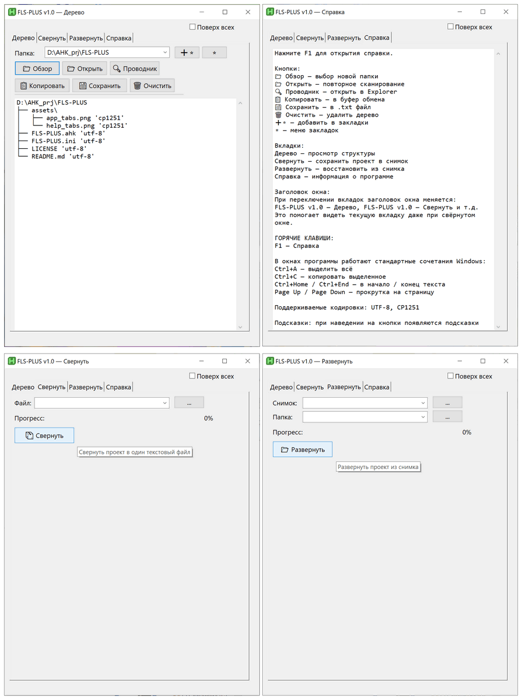
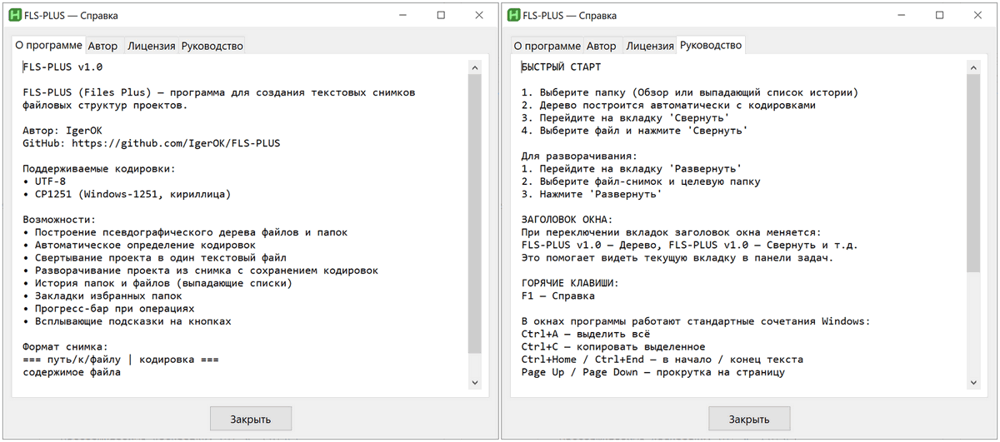

# FLS-PLUS (Files Plus) v1.0

[](https://www.autohotkey.com/)
[](LICENSE)
[]()

**FLS-PLUS** — программа для **Windows** для создания текстовых снимков файловых структур проектов с сохранением кодировок.

## 📋 Возможности

- **Псевдографическое дерево** — наглядное отображение структуры папок и файлов
- **Автоопределение кодировок** — UTF-8 и CP1251 (Windows-1251, кириллица)
- **Свёртывание проекта** — упаковка всего проекта в один текстовый файл
- **Развёртывание проекта** — восстановление файлов из снимка с сохранением кодировок
- **История** — выпадающие списки последних папок и файлов
- **Закладки** — быстрый доступ к избранным папкам
- **Прогресс-бар** — визуализация процесса при операциях
- **Всплывающие подсказки** — подсказки при наведении на кнопки

## 📸 Скриншоты

### Основное окно программы

  

> Все четыре вкладки основного окна на скриншоте `assets/app_tabs.png`

### Окно справки (F1)

  

> Вкладки справки на скриншоте `assets/help_tabs.png`

## 🚀 Быстрый старт

> ⚠️ **Требования:** Windows 7 и новее (только Windows, не кроссплатформенная).

### Вариант 1: Исходный код (AutoHotkey)
1. Установите [AutoHotkey v2.0](https://www.autohotkey.com/)
2. Запустите `FLS-PLUS.ahk` двойным кликом

### Вариант 2: Готовые EXE-файлы (без установки)
Если AutoHotkey не установлен, используйте скомпилированные версии для Windows:

| Файл | Описание |
|------|----------|
| `FLS-PLUS_v1.0-32.exe` | 32-битная версия для всех Windows (x86 и x64) |
| `FLS-PLUS_v1.0-32-64.exe` | 64-битная версия только для 64-разрядной Windows |

> 💡 **Совет:** Если не уверены в разрядности системы — используйте `FLS-PLUS_v1.0-32.exe`, он работает везде.

**Запуск:** просто дважды кликните по EXE-файлу. Никаких зависимостей не требуется.

---

**После запуска:**
1. Выберите папку проекта (кнопка **📁 Обзор** или выпадающий список)
2. Дерево файловой структуры построится автоматически
3. Перейдите на вкладку **Свернуть**, выберите файл и нажмите **📦 Свернуть**

## 📦 Формат снимка

```
=== путь/к/файлу | кодировка ===
содержимое файла
```

Поддерживаемые кодировки: `utf-8`, `cp1251`

## ⌨️ Горячие клавиши

| Клавиша | Действие |
|---------|----------|
| `F1` | Открыть справку |

## 🖼️ Интерфейс

- **Дерево** — просмотр и копирование файловой структуры
- **Свернуть** — сохранение проекта в текстовый снимок
- **Развернуть** — восстановление проекта из снимка
- **Справка** — информация о программе, авторе, лицензии и руководство

## ⌨️ Горячие клавиши

| Клавиша | Действие |
|---------|----------|
| `F1` | Открыть справку |

В окнах программы работают стандартные сочетания Windows для редактирования текста:
- `Ctrl+A` — выделить всё
- `Ctrl+C` — копировать выделенное
- `Ctrl+Home` / `Ctrl+End` — в начало / конец текста
- `Page Up` / `Page Down` — прокрутка на страницу

## 📝 Лицензия

[MIT License](LICENSE) — Copyright (c) 2026 IgerOK

## 👤 Автор

- **IgerOK**
- GitHub: [@IgerOK](https://github.com/IgerOK)
- Репозиторий: [https://github.com/IgerOK/FLS-PLUS](https://github.com/IgerOK/FLS-PLUS)

## 🙏 Благодарности

- Сообществу AutoHotkey
- Пользователям за обратную связь
